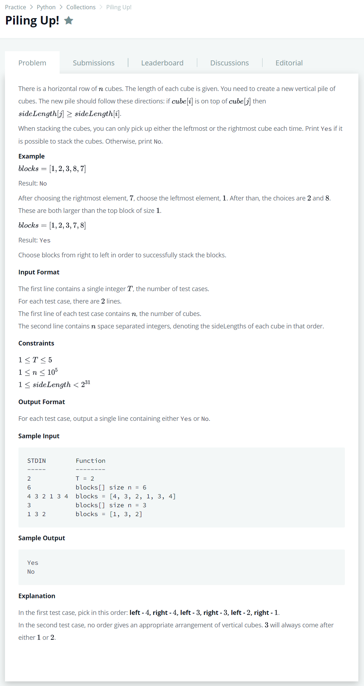

# [Piling Up!](https://www.hackerrank.com/challenges/piling-up/problem?h_r=next-challenge&h_v=zen)




### My Answer

```python
for _ in range(int(input())) : 
    size , blocks = int(input()), [int(x) for x in input().split(' ')]
    stack = [blocks.pop(0)] if blocks[0]>blocks[-1] else [blocks.pop(-1)]
    for _ in range(size-1) : 
        if max(blocks[0],blocks[-1])>stack[-1] : 
            print('No')
            break
        else : 
            stack.append(blocks.pop(0)) if blocks[0]>blocks[-1] else stack.append(blocks.pop(-1))
    if len(blocks)==0 : print('Yes')
```

* Time Complexity : O(n)
* Space Complexity : O(n)


### The things I got
