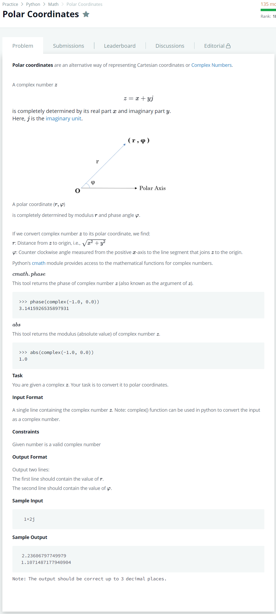

# [Polar Coordinates](https://www.hackerrank.com/challenges/polar-coordinates/problem)




### My Answer

```python
import sys
import cmath

inputs = complex(sys.stdin.readline())
x = inputs.real
y = inputs.imag

print((x**2+y**2)**.5)
print(cmath.phase(inputs))
```

* Time Complexity : O(1)
* Space Complexity : O(1)


### The things I got
