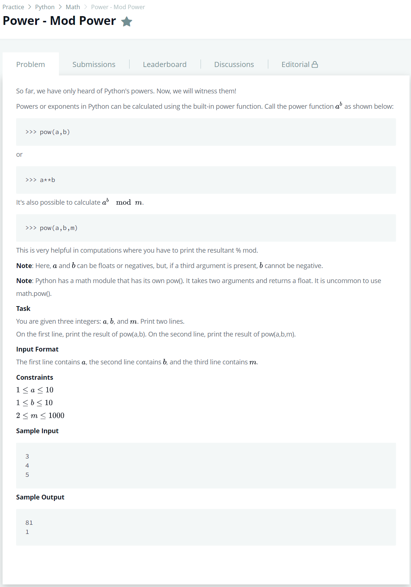

# [Power - Mod Power](https://www.hackerrank.com/challenges/python-power-mod-power/problem)




### My Answer

```python
a,b,m = [int(input()) for _ in '123']
print(pow(a,b),pow(a,b,m),sep='\n')
```

* Time Complexity : O(n)
* Space Complexity : O(n)


### The things I got
