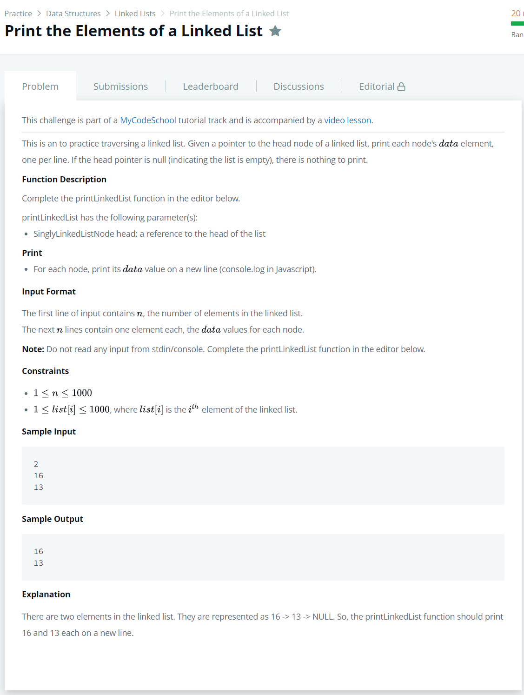

# [Print The Elements Of A Linked List](https://www.hackerrank.com/challenges/print-the-elements-of-a-linked-list/problem)




### My Answer

```python
# Complete the printLinkedList function below.

#
# For your reference:
#
# SinglyLinkedListNode:
#     int data
#     SinglyLinkedListNode next
#
#
def printLinkedList(head):
    while True : 
        print(head.data)
        if head.next : head = head.next
        else : break
```

* Time Complexity : O(n)
* Space Complexity : O(n)


### The things I got
