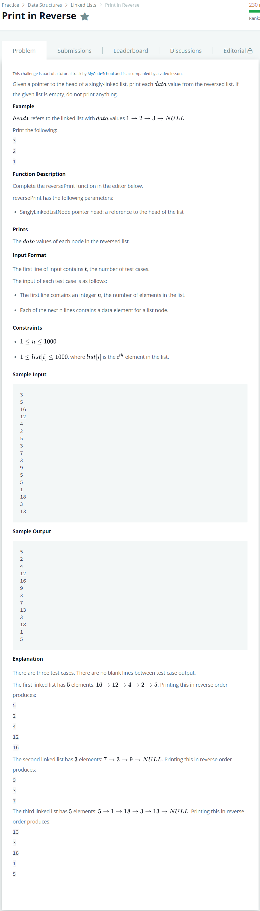

# [Print in Reverse](https://www.hackerrank.com/challenges/print-the-elements-of-a-linked-list-in-reverse/problem)




### My Answer

```python
def reversePrint(llist):
    if llist:
        reversePrint(llist.next)
        print(llist.data)
```

* Time Complexity : O(n)
* Space Complexity : O(1)


### The things I got
