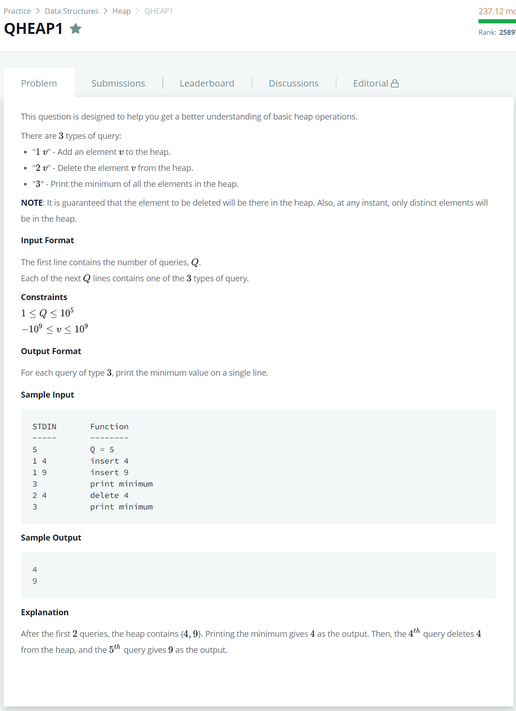

# [QHEAP1](https://www.hackerrank.com/challenges/qheap1/problem)




### My Answer

```python
def swapHeap(heap,source_index,target_index) : 
    temp = heap[source_index]
    heap[source_index]=heap[target_index]
    heap[target_index]=temp
    del temp
    

heap = []
for i in range(int(input())) : 
    query = input().split(' ')
    if query[0]=='1' : 
        heap.append(int(query[1]))
        target_index = len(heap)-1
        while heap[target_index//2] > heap[target_index] : 
            swapHeap(heap,target_index//2,target_index)
            target_index = target_index//2
    elif query[0]=='2' : 
        target_index = heap.index(int(query[1]))
        if target_index==len(heap)-1 : 
            heap.pop()
            continue
        heap[target_index] = heap.pop()

        if len(heap) > target_index*2+1 : 
            if heap[target_index*2] < heap[target_index*2+1] : 
                max_index=target_index*2
            else : 
                max_index=target_index*2+1
        elif len(heap) == target_index*2 : 
            max_index = target_index
        else : 
            continue
            
        while heap[target_index] > heap[max_index] :
            swapHeap(heap,target_index,max_index)
            target_index=max_index
    
    else : 
        print(heap[0])
```

* Time Complexity : O(n)
* Space Complexity : O(n)


### The things I got
