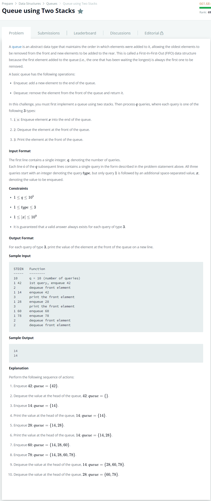

# [Queue Using Two Stacks](https://www.hackerrank.com/challenges/nested-list/problem)




### My Answer

```python
left, right = [], []
for _ in range(int(input())):
    inputs = list(map(int,input().split()))
    operation = inputs[0]
    
    if operation == 1:
        if not right :            # Row added
            first = inputs[1]        # Row added
        right.append(inputs[1])
    elif operation == 2:
        if not left :
            while right : left.append(right.pop())
        left.pop()
    else:
        print(left[-1] if left else first)
```

* Time Complexity : O(n)
* Space Complexity : O(2n)


### The things I got
