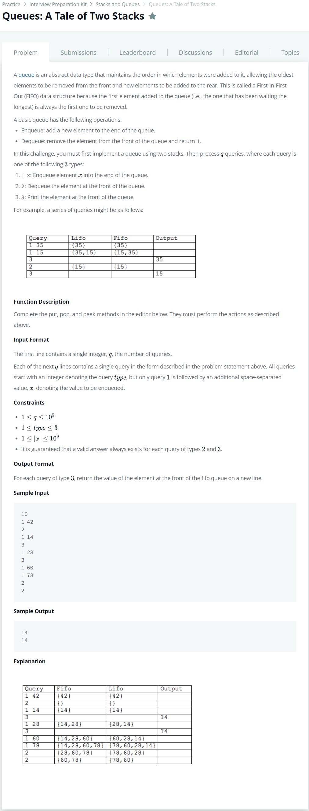

# [Queues : A Tale of Two Stacks](https://www.hackerrank.com/challenges/ctci-queue-using-two-stacks/problem)




### My Answer

```python
class MyQueue(object):
    def __init__(self):
        self.input = []
        self.output = []
    
    def peek(self):
        if len(self.output)==0 : 
            for i in range(len(self.input)) : 
                self.output.append(self.input.pop())
        return self.output[-1]

    def pop(self):
        if len(self.output)==0 : 
            self.peek()
        self.output.pop()

    def put(self, value):
        self.input.append(value)
```

* Time Complexity : O(n)
* Space Complexity : O(n)


### The things I got

스택으로 큐를 구현하는 문제. 기술 면접때도 종종 나온다니 기억해두자.