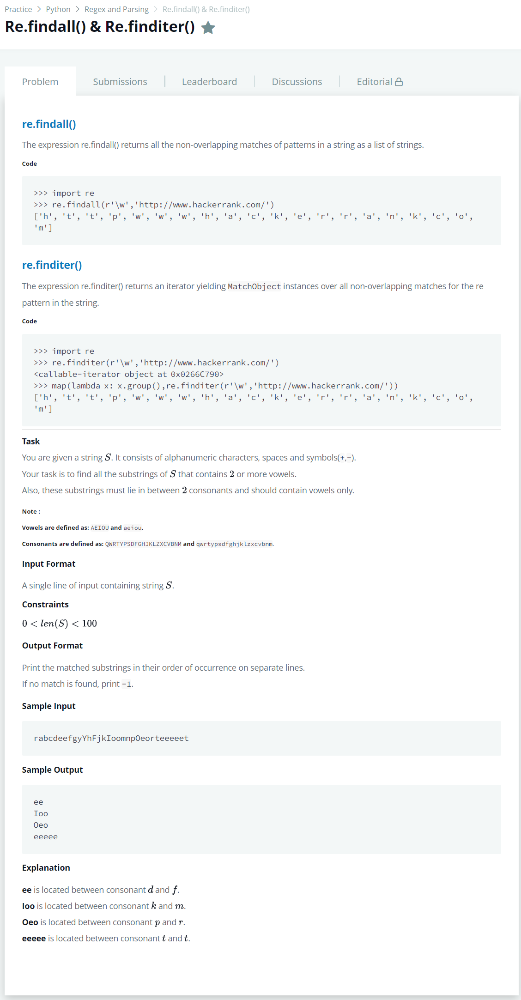

# [Re.findall() & Re.finditer()](https://www.hackerrank.com/challenges/re-findall-re-finditer/problem)




### My Answer

```python
import re
p = re.findall(r'(?<=[QWRTYPSDFGHJKLZXCVBNMqwrtypsdfghjklzxcvbnm])([AEIOUaeiou]{2,})[QWRTYPSDFGHJKLZXCVBNMqwrtypsdfghjklzxcvbnm]',input().strip(),flags = re.I)
print('\n'.join(p) if p else -1)
```

* Time Complexity : O(1)
* Space Complexity : O(1)


### The things I got
