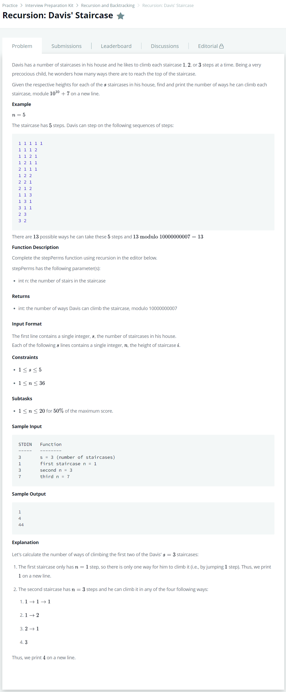

# [Recursion: Davis' Staircase](https://www.hackerrank.com/challenges/ctci-recursive-staircase/problem)




### My Answer

```python
def stepPerms(n):
    first = 1
    second = 2
    third = 4
    for i in range(n-1):
        first, second, third = second, third, first + second + third
    return first
```

* Time Complexity : O(n)
* Space Complexity : O(n)


### The things I got
