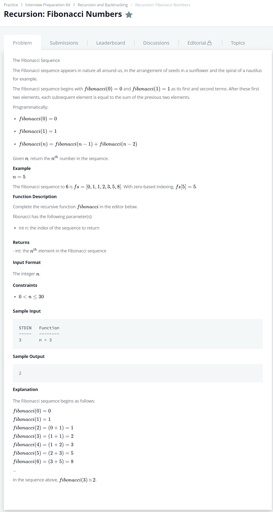

# [Recursion: Fibonacci Numbers](https://www.hackerrank.com/challenges/ctci-fibonacci-numbers/problem)




### My Answer

```python
def fibonacci(n):
    if n==0 : 
        return 0
    elif n==1 : 
        return 1
    return fibonacci(n-2)+fibonacci(n-1)

n = int(input())
print(fibonacci(n))
```

* Time Complexity : O(2n)
* Space Complexity : O(n)


### The things I got
