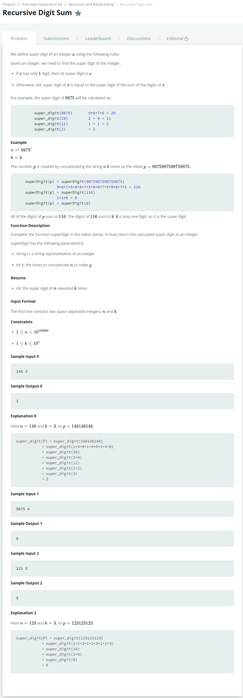

# [Recursive Digit Sum](https://www.hackerrank.com/challenges/recursive-digit-sum/problem)




### My Answer

```python
def superDigit(n, k):
    sum=0
    for i in range(len(n)) : 
        sum+=ord(n[i])-ord('0')
        if sum>9 : 
            sum-=9
    sum*=k
    sum%=9
    if sum==0 : 
        return 9
    return sum
```

* Time Complexity : O(n)
* Space Complexity : O(1)


### The things I got
