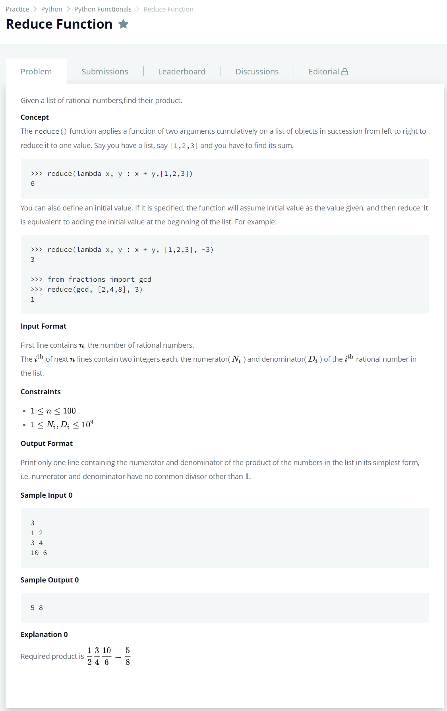

# [Reduce Function](https://www.hackerrank.com/challenges/reduce-function/problem)




### My Answer

```python
def product(fracs):
    t = reduce(lambda x,y : x*y,fracs)
    return t.numerator, t.denominator
```

* Time Complexity : O(n)
* Space Complexity : O(1)


### The things I got
