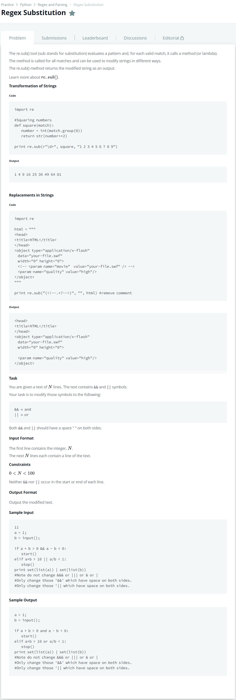

# [Regex Substitution](https://www.hackerrank.com/challenges/re-sub-regex-substitution/problem)




### My Answer

```python
import re

def convert(match):
    print(match)
    if match.group() == '&&' : 
        return 'and'
    else : 
        return 'or'

string = ''
for _ in range(int(input())) : 
    string += input()+'\n'

print(re.sub("\<\s(\|{2}|\&{2})\s$", convert, string[:-1]))
```

* Time Complexity : O(1)
* Space Complexity : O(1)


### The things I got
