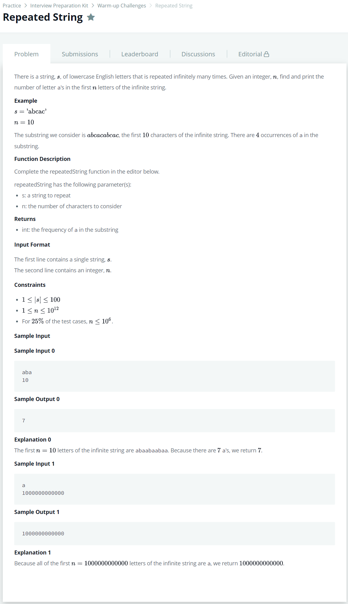

# [Repeated String](https://www.hackerrank.com/challenges/repeated-string/problem?h_l=interview&playlist_slugs%5B%5D=interview-preparation-kit&playlist_slugs%5B%5D=warmup)




### My Answer

```python
def repeatedString(s, n):
    return n//len(s)*s.count('a')+s[:n%len(s)].count('a')
```

* Time Complexity : O(1)
* Space Complexity : O(1)


### The things I got
