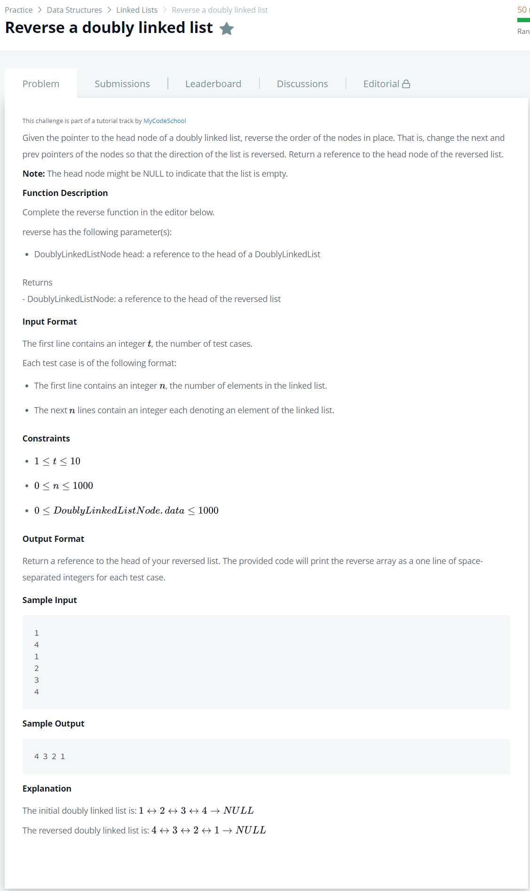

# [Reverse a Doubly Linked List](https://www.hackerrank.com/challenges/reverse-a-doubly-linked-list/problem)




### My Answer

```python
def reverse(llist):
    if llist==None : 
        return llist
    llist.next, llist.prev = llist.prev, llist.next
    if llist.prev==None : 
        return llist
    return reverse(llist.prev)
```

* Time Complexity : O(n)
* Space Complexity : O(n)


### The things I got
