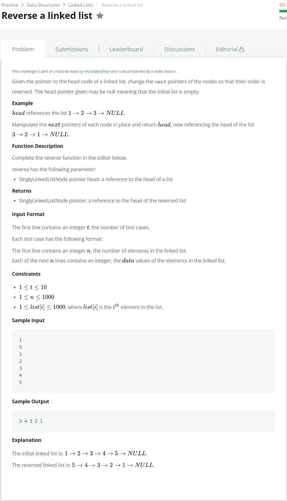

# [Reverse a Linked List](https://www.hackerrank.com/challenges/reverse-a-linked-list/problem)




### My Answer

```python
def reverse(llist):
    if llist==None or llist.next==None : 
        return llist
    
    Head = llist.next
    Tail = llist
    while Tail.next : 
        temp = Head
        Head = Head.next

        temp.next = llist
        Tail.next = Head
        llist = temp

    return llist
```

* Time Complexity : O(n)
* Space Complexity : O(n)


### The things I got
