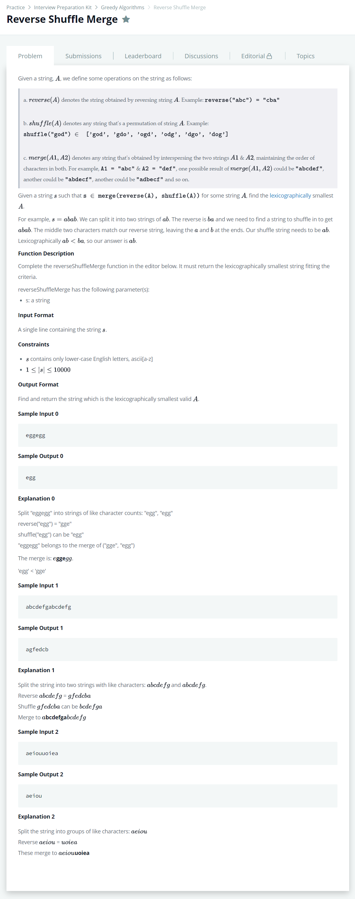

# [Reverse Shuffle Merge](https://www.hackerrank.com/challenges/reverse-shuffle-merge/problem)




### My Answer

```python
from collections import defaultdict

def freq(s) : 
    f = defaultdict(int)
    for x in s : 
        f[x] += 1
    return f

def reverseShuffleMerge(s):
    count_dic = freq(s)
    
    #s = Merge(main,sub)
    main = defaultdict(int)
    sub = defaultdict(int)
    
    stack = []
    
    def usable(char) : 
        return (count_dic[char]//2 - main[char]) > 0
            
    # remain = count_dic - main - sub
    # popable = remain + main - 1(pop) >= count_dic//2
    # so, popable == count_dic-sub-1 >= count_dic//2 == count_dic//2 >= sub+1
    def popable(char) : 
        return sub[char]+1 <= count_dic[char]//2
    
    
    for x in reversed(s) : 
        if usable(x) : 
            while len(stack) and x < stack[-1] and popable(stack[-1]): 
                top = stack.pop()
                main[top] -= 1
                sub[top] += 1
            stack.append(x)
            main[x] += 1
        else : 
            sub[x] += 1
        
    return ''.join(stack)
```

* Time Complexity : O(n)
* Space Complexity : O(3n)


### The things I got

[Largest Rectangle](../LargestRectangle/LargestRectangle.md) 문제의 연장선이다.  

문자열을 뒤집어서 사전 오름차순으로 stack에 push 하다가 낮은 문자를 만나면 stack을 모두 pop하고(pop 할 수 있는 선에서) 해당 문자를 넣는 식이다.    

예를 들어서, s = abefd라고 하면,    

stack은 [a] -> [a,b] -> [a,b,e] -> [a,b,e,f] 까지 push 했다가 d를 만나서    

[a,b,e,f] -> [a,b,e] -> [a,b] 로 pop을 두번 실시하고 해당 문자를 push하여  

[a,b] -> [a,b,d] 가 되는 꼴이다.    

해당 유형의 문제들을 많이 연습해보도록 하자. 
