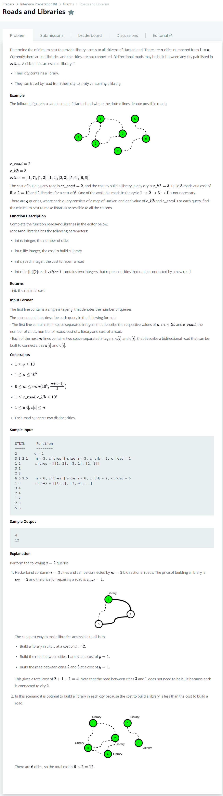

# [Roads And Libraries](https://www.hackerrank.com/challenges/torque-and-development/problem)




### My Answer

```python

def makeGraph(cities) : 
    G = defaultdict(set)
    for city in cities : 
        G[city[0]].add(city[1])
        G[city[1]].add(city[0])
    return G


def roadsAndLibraries(n, c_lib, c_road, cities):
    if n*c_lib < len(cities)*c_road : 
        return n*c_lib
    else : 
        G = makeGraph(cities)
        #print(G)
        components = []
        used = set()
        
        total = 0
        for key in list(G.keys()) : 
            if key in used : continue
            else : 
                stack = [key]
                seen = set([key])
                counting_star = 0
                
                while stack : 
                    pop_node = stack.pop()
                    
                    for x in G[pop_node] : 
                        if x in seen : 
                            continue
                        else : 
                            seen.add(x)
                            stack.append(x)
                            counting_star+=1
                        
                components.append(seen)
                used = used.union(seen)
                #print("counting_star!",counting_star)
                total+=counting_star*c_road+c_lib
        #print("total =",total)
        return total
            
        total_cost = 0
        for comp in components : 
            edge_num = 0
            for x in comp : 
                edge_num += len(G[x])
            #print("edge_num:",edge_num//2)
            total_cost+=(edge_num//2-1)*c_road+c_lib
                
        #print(components)
        #print(used)
        return total_cost

```

* Time Complexity : O(n)
* Space Complexity : O(2n)


### The things I got

그래프를 시작했다. 감 잡기가 어려워 Discussion을 많이 참고하는중