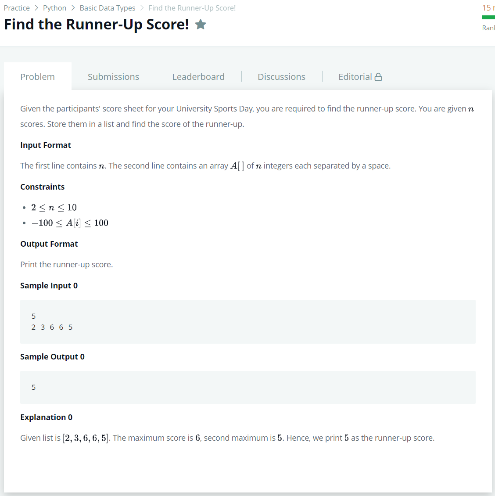

# [Find the Runner-Up Score!](https://www.hackerrank.com/challenges/find-second-maximum-number-in-a-list/problem?h_r=next-challenge&h_v=zen&h_r=next-challenge&h_v=zen&h_r=next-challenge&h_v=zen&h_r=next-challenge&h_v=zen&h_r=next-challenge&h_v=zen)




### My Answer

```python
maximum=-101
runnerUp=-101

for x in arr : 
    if x>maximum : 
        if maximum>=runnerUp : 
            	runnerUp=maximum
        maximum=x
    elif x==maximum : continue
    elif x>=runnerUp : runnerUp=x
    else : continue

print(runnerUp)
```

* Time Complexity : O(n)
* Space Complexity : O(1)


### The things I got
