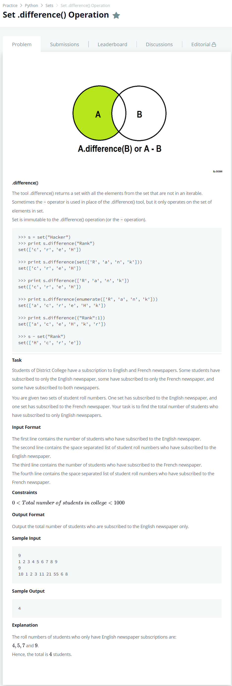

# [Set.difference() Operation](https://www.hackerrank.com/challenges/py-set-difference-operation/problem)




### My Answer

```python
n1 = int(input())
set_1 = set(map(int,input().split()))
n2 = int(input())
set_2 = set(map(int,input().split()))
print(len(set_1-set_2))
```

* Time Complexity : O(n)
* Space Complexity : O(n)


### The things I got
