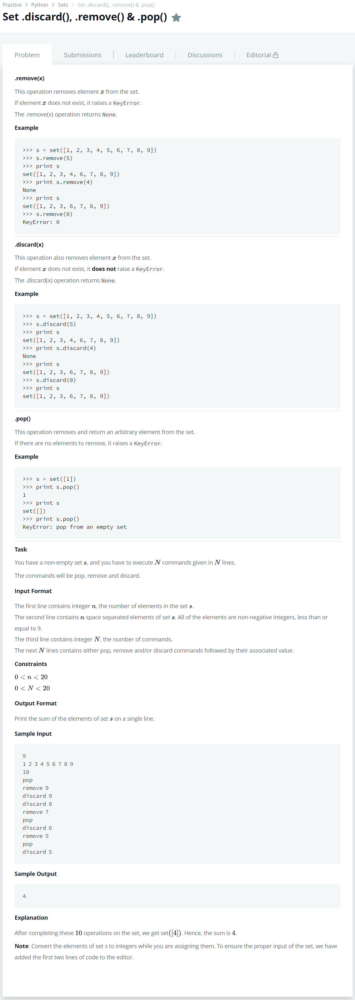

# [Set .discard(), .remove() & .pop()](https://www.hackerrank.com/challenges/py-set-discard-remove-pop/problem)




### My Answer

```python
n = int(input())
s = set(map(int, input().split())) 
for i in range(int(input())):
    eval('s.{0}({1})'.format(*input().split()+['']))

print(sum(s))
```

* Time Complexity : O(n)
* Space Complexity : O(logn)


### The things I got
