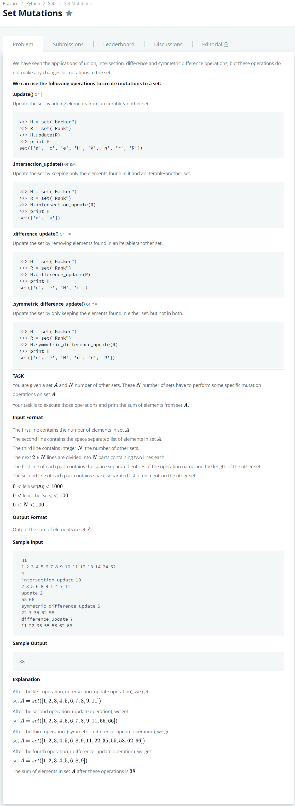

# [Set Mutations](https://www.hackerrank.com/challenges/py-set-mutations/problem)




### My Answer

```python
_, preset = input(), set([int(x) for x in input().split(' ')])

for _ in range(int(input())) : 
    operation = input().split(' ')[0]
    subset = set([int(x) for x in input().split(' ')])
    eval('preset.'+operation+'(subset)')
print(sum(preset))
```

* Time Complexity : O(n)
* Space Complexity : O(n)


### The things I got
