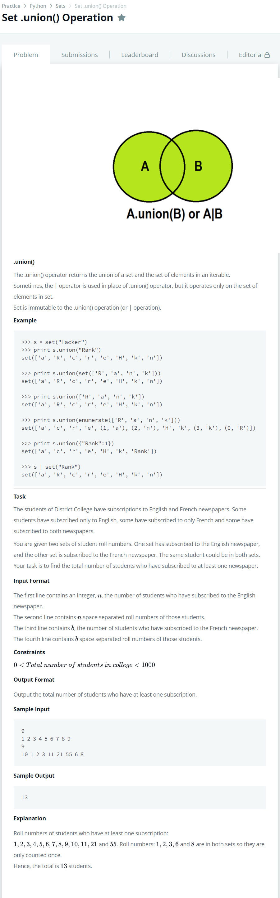

# [Set.union Operation](https://www.hackerrank.com/challenges/py-set-union/problem)




### My Answer

```python
input()
eng = set(input().replace('\n','').split(' '))
input()
frn = set(input().replace('\n','').split(' '))
print(len(eng.union(frn)))
```

* Time Complexity : O(n)
* Space Complexity : O(n)


### The things I got
