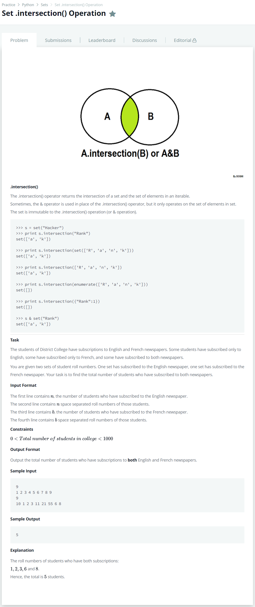

# [Set.intersection() Operation](https://www.hackerrank.com/challenges/py-set-intersection-operation/problem)




### My Answer

```python
_, a = input(), set(input().split())
_, b = input(), set(input().split())
print(len(a.intersection(b)))
```

* Time Complexity : O(n)
* Space Complexity : O(n)


### The things I got
