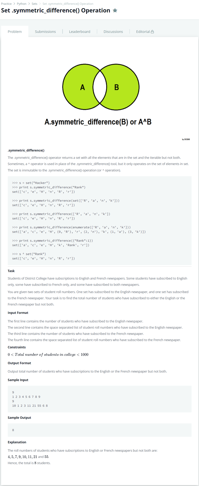

# [Set .symmetric_difference() Operation](https://www.hackerrank.com/challenges/py-set-symmetric-difference-operation/problem)




### My Answer

```python
_, A, _, B = input(), input().split(' '), input(), input().split(' ')
print(len(set(A).symmetric_difference(set(B))))
```

* Time Complexity : O(n)
* Space Complexity : O(n)


### The things I got
