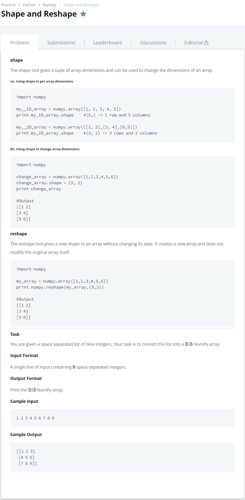

# [Shape and Reshape](https://www.hackerrank.com/challenges/np-shape-reshape/problem)




### My Answer

```python
import numpy as np
print(np.array(input().split(' '),dtype=int).reshape((3,3)))
```

* Time Complexity : O(1)
* Space Complexity : O(n)


### The things I got
