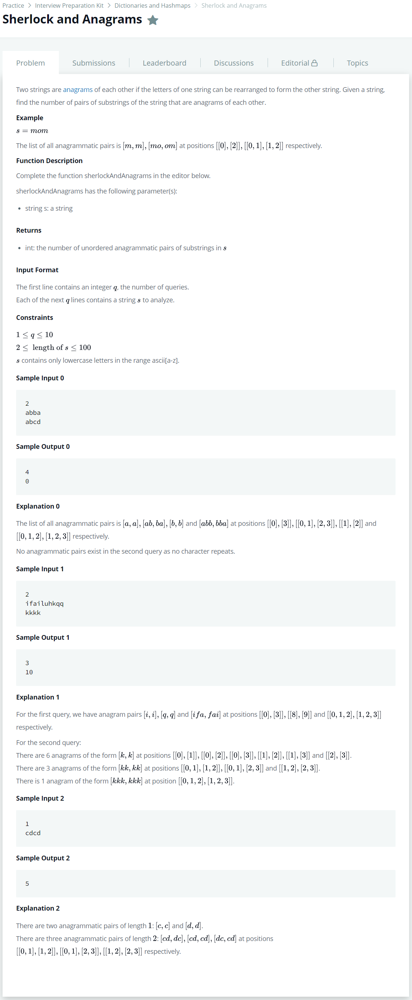

# [Sherlock and Anagrams](https://www.hackerrank.com/challenges/sherlock-and-anagrams/problem?h_l=interview&playlist_slugs%5B%5D=interview-preparation-kit&playlist_slugs%5B%5D=dictionaries-hashmaps)




### My Answer

```python
def sherlockAndAnagrams(s):
    hashmap = defaultdict(int)
    count=0
    for index in range(len(s)) : 
        for length in range(1,len(s)-index+1) : 
            substring = s[index:index+length]
            hashmap[''.join(sorted(substring))]+=1
                
    # the number of collections : xC2
    for x in hashmap.values() : 
        count+=(x**2-x)//2
    return count
```

* Time Complexity : O(nlog(n)*mlog(m))
* Space Complexity : O(n^2/2)


### The things I got

어차피 n^3할거면 n이 작은거(위의 경우 sorting)를 하는게 낫다.  