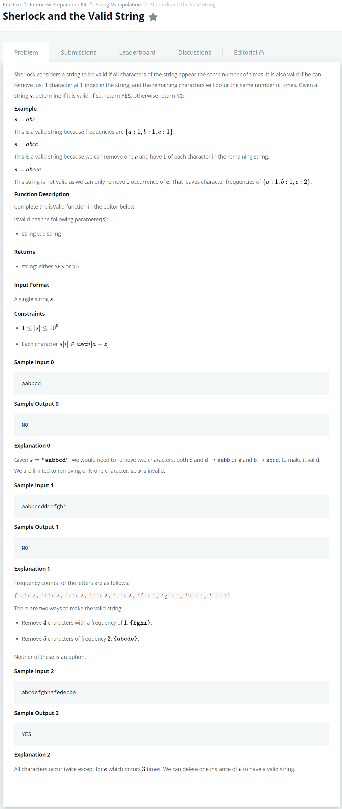

# [Sherlock and the Valid String](https://www.hackerrank.com/challenges/sherlock-and-valid-string/problem)




### My Answer

```python
from collections import defaultdict

def isValid(s):
    if len(s)==1 or len(s)==2: 
        return 'YES'
    
    freq = defaultdict(int)
    for x in s : 
        freq[x]+=1
    
    values = freq.values()
    maximum, minimum = max(values), min(values)
    if maximum == minimum : return 'YES'
    filtered = [value==maximum for key,value in freq.items()] 
    max_count = filtered.count(True)
    min_count = filtered.count(False)
    if (max_count==1 or min_count==1) and (maximum-minimum==1 or min_count==1):
        return 'YES'
    else : 
        return 'NO'
```

* Time Complexity : O(n)
* Space Complexity : O(n)


### The things I got
