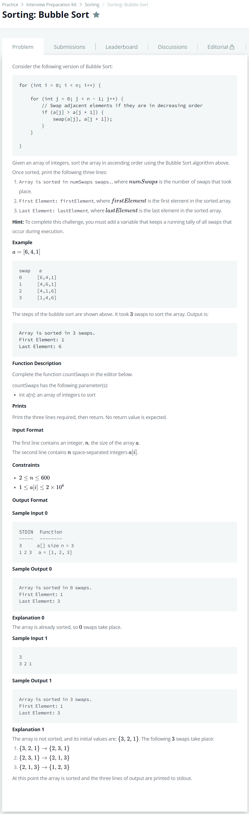

# [Sorting: Bubble Sort](https://www.hackerrank.com/challenges/ctci-bubble-sort/problem?h_l=interview&playlist_slugs%5B%5D=interview-preparation-kit&playlist_slugs%5B%5D=sorting)




### My Answer

```python
def countSwaps(a):
    count=0
    for _ in range(len(a)) : 
        flag=0
        for i in range(len(a)-1) : 
            if a[i] > a[i+1] : 
                flag=1
                count+=1
                temp = a[i+1]
                a[i],a[i+1] = temp,a[i]
        if flag==0 : 
            break
    
    print('Array is sorted in {} swaps.'.format(count))
    print('First Element: {}'.format(a[0]))
    print('Last Element: {}'.format(a[-1]))
```

* Time Complexity : O(n~n^2)
* Space Complexity : O(n)


### The things I got
