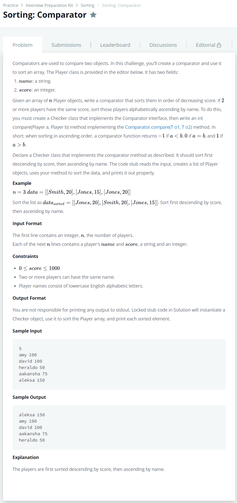

# [Sorting : Comparator](https://www.hackerrank.com/challenges/ctci-comparator-sorting/forum?h_l=interview&playlist_slugs%5B%5D=interview-preparation-kit&playlist_slugs%5B%5D=sorting)




### My Answer

```python
class Player:
    def __init__(self, name, score):
        self.name = name
        self.score = score
    def __repr__(self):
        return name, score
    def comparator(self,counter):
        if self.score > counter.score : 
            return -1
        elif self.score < counter.score : 
            return 1
        else : 
            if self.name < counter.name : 
                return -1
            elif self.name > counter.name : 
                return 1
            else : 
                return 0
```

* Time Complexity : O(-)
* Space Complexity : O(-)


### The things I got
