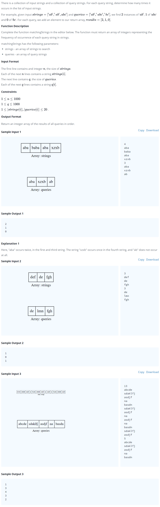

# [Sparse Arrays](https://www.hackerrank.com/challenges/sparse-arrays/problem?h_r=next-challenge&h_v=zen)




### My Answer

```python
def matchingStrings(strings, queries):
    result = {}
    for q in queries : 
        result[q] = 0
        
    for s in strings :
        result[s] = 0

    for s in strings : 
        result[s] += 1
        
    return [result[q] for q in queries]
```

* Time Complexity : O(n)
* Space Complexity : O(n)


### The things I got

**dictionary complexity** : dictionary's keys are stored on hash table (keys = ids) : O(1)

study with [baealex](https://blex.me/@baealex/파이썬-자료형별-연산자의-복잡도)