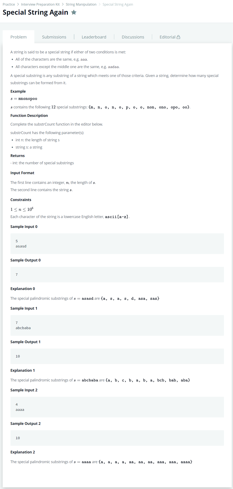

# [Special String Again](https://www.hackerrank.com/challenges/special-palindrome-again/problem)




### My Answer

```python
def substrCount(n, s):

    dic = defaultdict(list)
    dic2 = defaultdict(list)

    indexs = []
    history = s[0]
    start = -1
    end = -1

    for i in range(0,len(s)) : 
        dic[s[i]].append(i)
        if s[i]==history : 
            if start == -1 : 
                start = i
            elif i==len(s)-1 or s[i+1]!=history :
                end = i
                dic2[history].append((start,end))
                start = -1
                end = -1
            else : 
                pass
        else : 
            start = i
            history = s[i]

    single_count = len(s)
    mirror_count1 = sum([sum([(k[i]-k[i-1])==2 for i in range(1,len(k))]) for k in dic.values()])

    mirror_count2 = 0
    comb_count = 0

    for k in dic2.values() : 
        for i in range(0,len(k)) : 
            if i>0 and (k[i][0]-k[i-1][1])==2 : 
                mirror_count2 += min(k[i-1][1]-k[i-1][0],k[i][1]-k[i][0])
            n = k[i][1]-k[i][0]
            comb_count += n*(n+1)//2

    total_count = single_count + mirror_count1+ mirror_count2 + comb_count
    return total_count

```

* Time Complexity : O(nlogn)
* Space Complexity : O(n)


### The things I got
