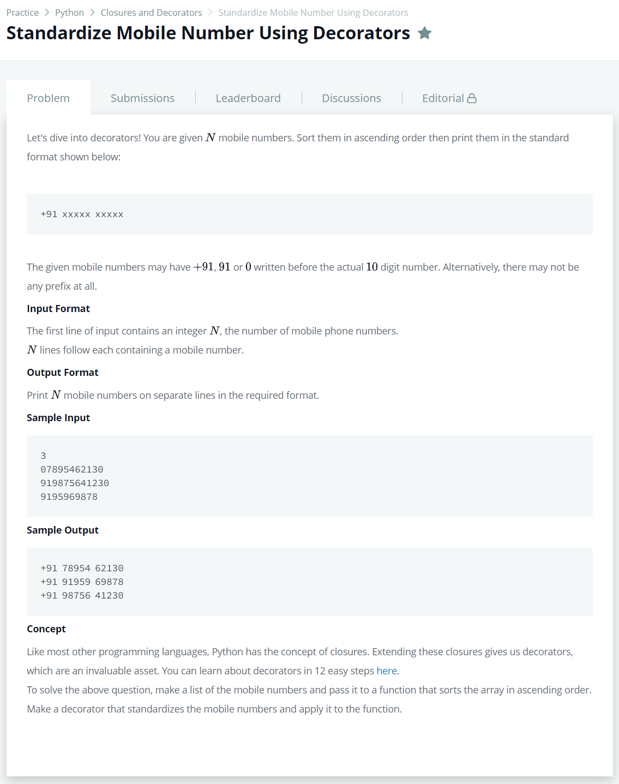

# [Standardize Mobile Number Using Decorators](https://www.hackerrank.com/challenges/standardize-mobile-number-using-decorators/problem)




### My Answer

```python
def wrapper(f):
    def fun(l):
        output = []
        for x in l : 
            if len(x)==10 : output.append('+91 '+str(x[:5])+' '+str(x[5:]))
            elif len(x)==11 : output.append('+91 '+str(x[1:6])+' '+str(x[6:]))
            elif len(x)==13 : output.append('+91 '+str(x[3:8])+' '+str(x[8:]))
            else : output.append('+91 '+str(x[2:7])+' '+str(x[7:]))
        for y in sorted(output) : 
            print(y)
    return fun
```

* Time Complexity : O(2n)
* Space Complexity : O(n)


### The things I got
