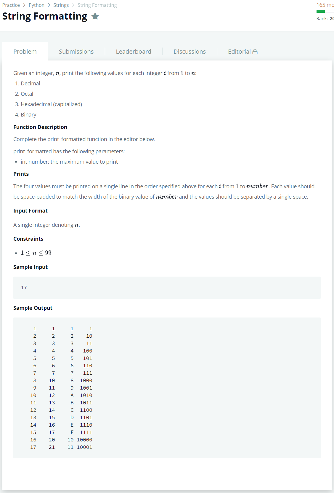

# [String Formatting](https://www.hackerrank.com/challenges/python-string-formatting/problem?h_r=next-challenge&h_v=zen)




### My Answer

```python
def print_formatted(number):
    n = str(len((bin(number)[2:])))
    for i in range(1,number+1) : 
        d = ('{0:>'+n+'}').format(i)
        o = ('{0:>'+n+'}').format(oct(i)[2:])
        h = ('{0:>'+n+'}').format(hex(i)[2:].upper())
        b = ('{0:>'+n+'}').format(bin(i)[2:])
        print(d+' '+o+' '+h+' '+b)
```

* Time Complexity : O(n)
* Space Complexity : O(n)


### The things I got
