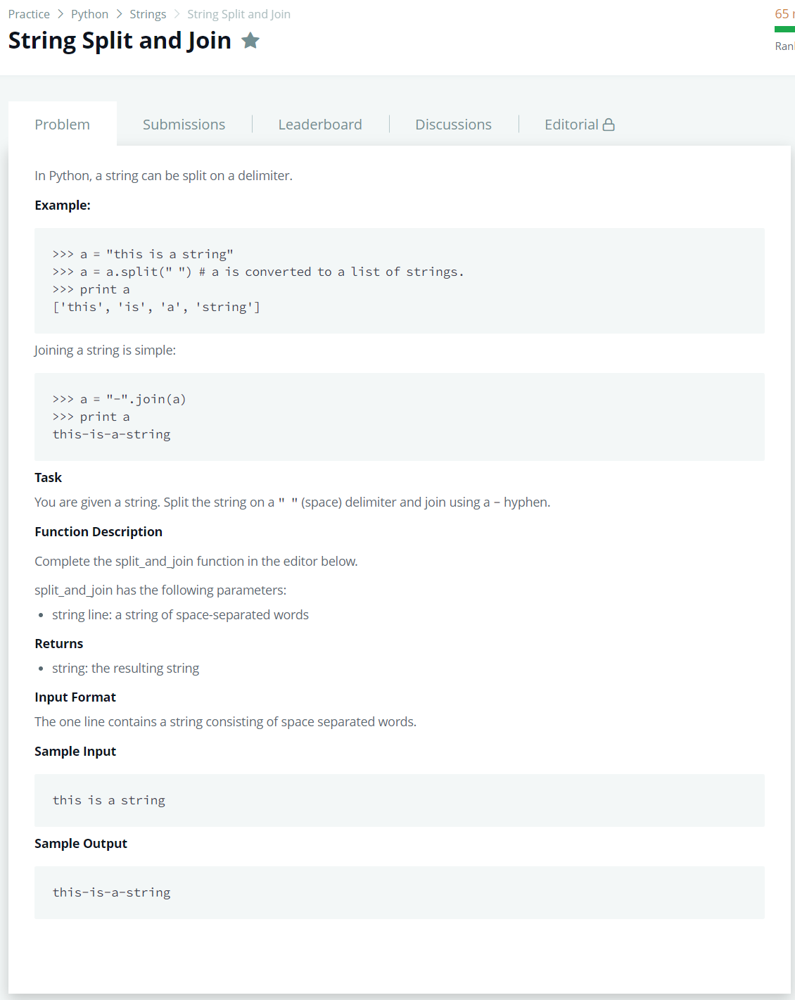

# [String Split And Join](https://www.hackerrank.com/challenges/python-string-split-and-join/problem)




### My Answer

```python
def split_and_join(line):
    return '-'.join(line.split(' '))
```

* Time Complexity : O(n)
* Space Complexity : O(n)


### The things I got
