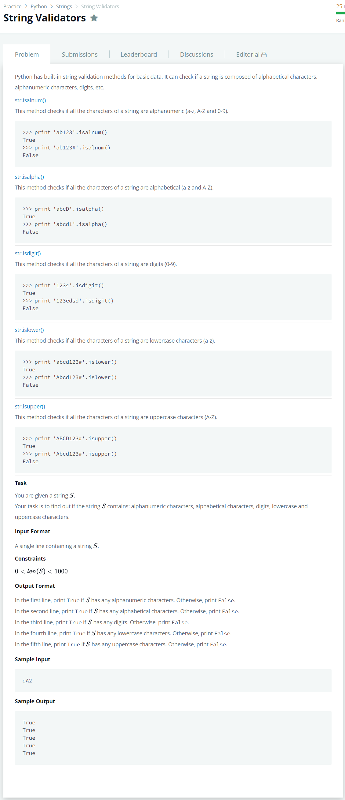

# [String Validators](https://www.hackerrank.com/challenges/string-validators/problem?h_r=next-challenge&h_v=zen)




### My Answer

```python
if __name__ == '__main__':
    s = input()
    print(any([x.isalnum() for x in s]))
    print(any([x.isalpha() for x in s]))
    print(any([x.isdigit() for x in s]))
    print(any([x.islower() for x in s]))
    print(any([x.isupper() for x in s]))
```

* Time Complexity : O(n)
* Space Complexity : O(1)


### The things I got
