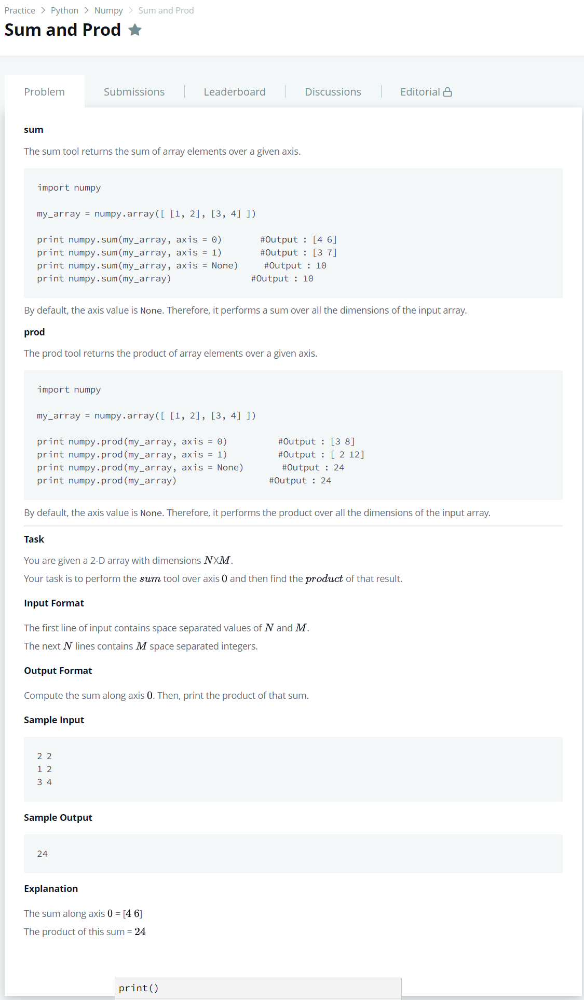

# [Sum and Prod](https://www.hackerrank.com/challenges/np-sum-and-prod/problem)




### My Answer

```python
import numpy as np

N,M = [int(x) for x in input().split(' ')]

print(np.product(np.sum(np.array([[int(x) for x in input().split(' ')] for _ in range(N)]),axis=0)))
```

* Time Complexity : O(1)
* Space Complexity : O(1)


### The things I got
