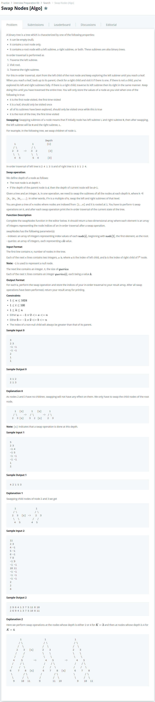

# [Swap Nodes [Algo]](https://www.hackerrank.com/challenges/swap-nodes-algo/problem)




### My Answer

```python
from queue import Queue

class Node() : 
    def __init__(self,data) : 
        self.data = data
        self.left = None
        self.right = None

def Inorder(node) : 
    stack = []
    head = node
    result = []
    while len(stack) or head : 
        while head : 
            stack.append(head)
            head=head.left
        head = stack.pop()
        result.append(head.data)
        head = head.right
    return result      

def swapNodes(indexes, queries):
    root = Node(1)
    q = Queue()
    q.put(root)
    
    #make BST
    for x in indexes : 
        head = q.get()
        left, right = x
        if left==-1 : 
            left=None
        else : 
            temp_node = Node(left)
            head.left = temp_node
            q.put(temp_node)
        if right==-1 : 
            right=None
        else : 
            temp_node = Node(right)
            head.right = temp_node
            q.put(temp_node)

    result = []
    for y in queries : 
        q = Queue()
        q.put(root)
        previous_valid = 1
        current_valid = 0
        level = 1
        while q.qsize() : 
            current_valid = 0
            for _ in range(previous_valid) : 
                node = q.get()
                #swap case
                if level%y==0 : 
                    temp_node = node.left
                    node.left = node.right
                    node.right = temp_node    
                
                #pass case
                else :
                    pass
                
                if node.left : 
                    q.put(node.left)
                    current_valid += 1
                if node.right : 
                    q.put(node.right)
                    current_valid += 1
            previous_valid = current_valid
            level += 1
        
        result.append(Inorder(root))
        
    return result
```

* Time Complexity : O(n)
* Space Complexity : O(n)


### The things I got
