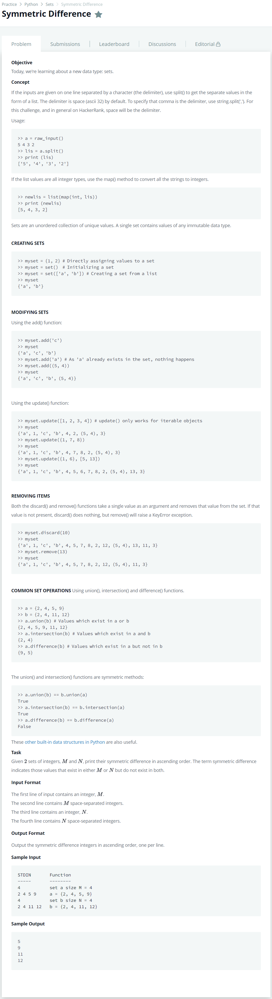

# [Symmetric Difference](https://www.hackerrank.com/challenges/symmetric-difference/problem)




### My Answer

```python
a,b=(int(input()),input().split())
c,d=(int(input()),input().split())
x=set(b)
y=set(d)
p=y.difference(x)
q=x.difference(y)
r=p.union(q)
print ('\n'.join(sorted(r, key=int)))
```

* Time Complexity : O(n)
* Space Complexity : O(n)


### The things I got
