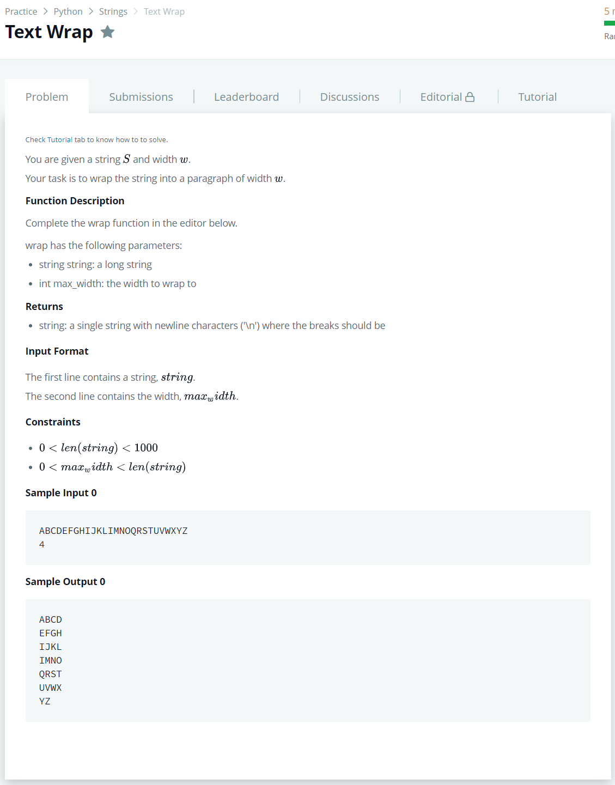

# [Text Wrap](https://www.hackerrank.com/challenges/text-wrap/problem?h_r=next-challenge&h_r%5B%5D%5B%5D=next-challenge&h_r%5B%5D%5B%5D=next-challenge&h_v=zen&h_v%5B%5D%5B%5D=zen&h_v%5B%5D%5B%5D=zen&isFullScreen=false)




### My Answer

```python
def wrap(string, max_width):
    output = []
    for i in range(len(string)//max_width) : 
        output.append(string[i*max_width:i*max_width+max_width])
    output.append(string[(len(string)//max_width)*max_width:])
    return '\n'.join(output)
```

* Time Complexity : O(n)
* Space Complexity : O(n)


### The things I got
