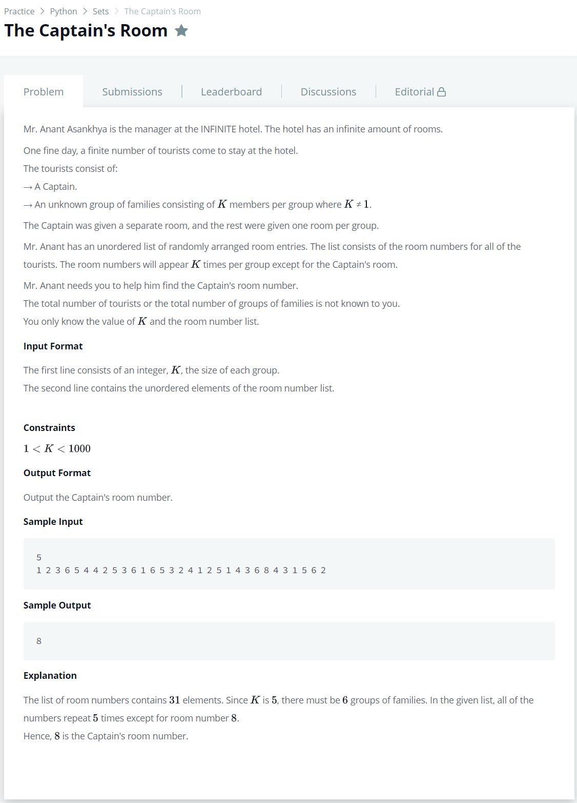

# [The Captain's Room](https://www.hackerrank.com/challenges/py-the-captains-room/problem)




### My Answer

```python
import sys
from collections import defaultdict

k = sys.stdin.readline()
rooms = sys.stdin.readline().split(' ')
families = defaultdict(int)
for r in rooms : 
    families[r]+=1

print(list(families.keys())[list(families.values()).index(1)])
```

* Time Complexity : O(n)
* Space Complexity : O(n)


### The things I got
