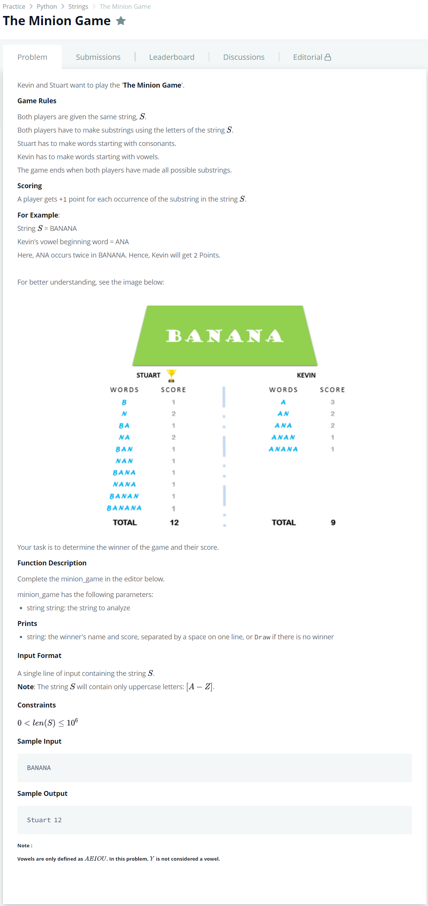

# [The Minion Game](https://www.hackerrank.com/challenges/the-minion-game/problem)




### My Answer

```python
def minion_game(string):
    Kevin = 0
    n = len(string)
    
    for i in range(n) : 
        if string[i] in ('A','E','I','O','U') : 
            Kevin += n-i
    
    Stuart = (n*(n+1))//2 - Kevin
    
    if Stuart > Kevin : 
        print('Stuart '+str(Stuart))
    elif Kevin > Stuart : 
        print('Kevin '+str(Kevin))
    else : print('Draw') 
    

if __name__ == '__main__':
    s = input()
    minion_game(s)
```

* Time Complexity : O(n)
* Space Complexity : O(1)


### The things I got
