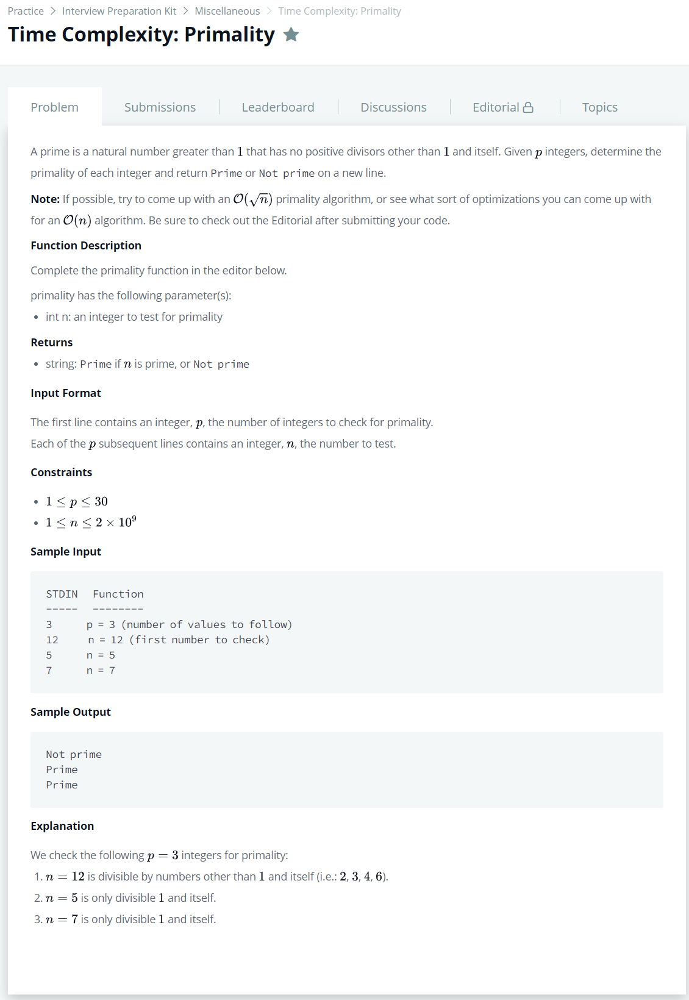

# [Time Complexity : Primality](https://www.hackerrank.com/challenges/ctci-big-o/problem)




### My Answer

```python
def primality(n):
    if n==1 : return 'Not prime'
    count=0
    for i in range(1,int(n**.5)+1) : 
       if n%i==0 : count+=1
    return 'Prime' if count==1 else 'Not prime'
```

* Time Complexity : O(log(n))
* Space Complexity : O(1)


### The things I got
