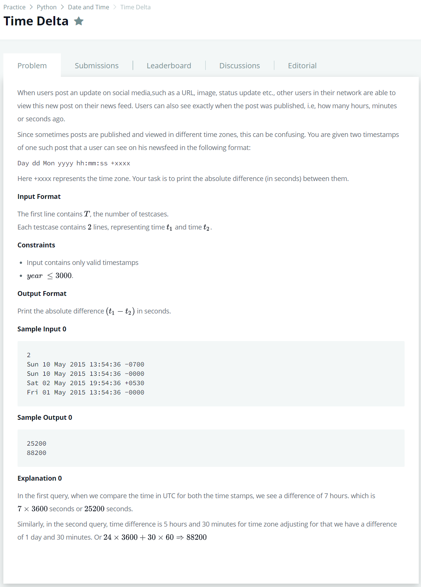

# [Time Delta](https://www.hackerrank.com/challenges/python-time-delta/problem)




### My Answer

```python
#!/bin/python

import math
import os
import random
import re
import sys

def toTimestamp(t) : 
    days = [31,28,31,30,31,30,31,31,30,31,30,31]
    months = ['Jan','Feb','Mar','Apr','May','Jun','Jul','Aug','Sep','Oct','Nov','Dec']
    Day,d,month,year,time,timezone = t.split(' ')
    
    if isLearYear(year) : days[1] = 29
    month_to_days = sum(days[:months.index(month)])+int(d)
    
    hour,minute,second = time.split(':')
    
    one = int(hour)*3600 + int(minute)*60 + int(second) + int(timezone[0]+'1')*-1*(int(timezone[1:3])*3600+int(timezone[3:])*60)
    
    timestamp = month_to_days * 86400 + one
    return timestamp, int(year)
    
    
def isLearYear(year) : 
    year = int(year)
    if year%4==0 :
        if year%100==0 : 
            if year%400==0 : 
                return True
            else : return False
        else : 
            return True
    else : return False


# Complete the time_delta function below.
def time_delta(t1, t2):
    
    timestamp1, year1 = toTimestamp(t1)
    timestamp2, year2 = toTimestamp(t2)
    
    year_to_days = 0
    for i in range(min(year1,year2),max(year1,year2)) : 
        if isLearYear(i) : year_to_days+=366
        else : year_to_days += 365

    if year1 > year2 : timestamp1 += (year_to_days)*86400
    elif year1 < year2 : timestamp2 += (year_to_days)*86400
    else : pass
    
    return str(abs(timestamp1-timestamp2))

if __name__ == '__main__':
    fptr = open(os.environ['OUTPUT_PATH'], 'w')

    t = int(raw_input())

    for t_itr in xrange(t):
        t1 = raw_input()

        t2 = raw_input()

        delta = time_delta(t1, t2)

        fptr.write(delta + '\n')

    fptr.close()

```

* Time Complexity : O(n)
* Space Complexity : O(n)


### The things I got
