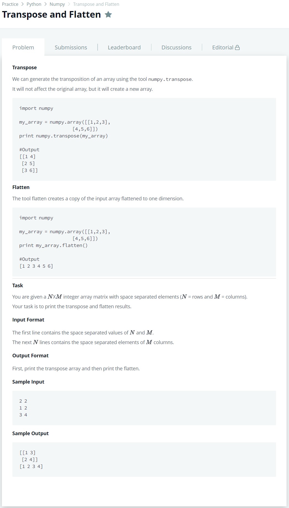

# [Transpose And Flatten](https://www.hackerrank.com/challenges/np-transpose-and-flatten/problem)




### My Answer

```python
import numpy as np

N,M = map(lambda x : int(x),input().split())
array = np.array([list(map(lambda x : int(x),input().split())) for m in range(N)])
print(array.T)
print(array.flatten())
```

* Time Complexity : O(n)
* Space Complexity : O(n)


### The things I got
