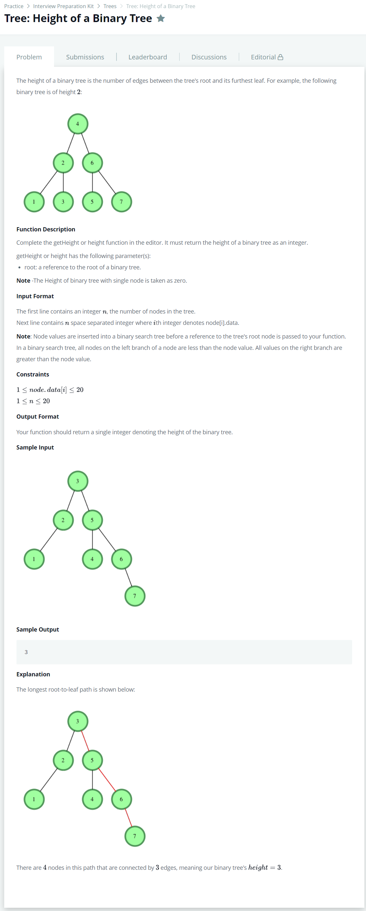

# [Tree: Height Of a Binary Tree](https://www.hackerrank.com/challenges/tree-height-of-a-binary-tree/problem)




### My Answer

```python
def height(root):
    if root.right==None and root.left==None :
        return 0
  
    left, right = 0,0
    if root.left : 
        left = height(root.left)
    if root.right : 
        right = height(root.right)
    return max(left,right)+1
```

* Time Complexity : O(n)
* Space Complexity : O(2n)


### The things I got
