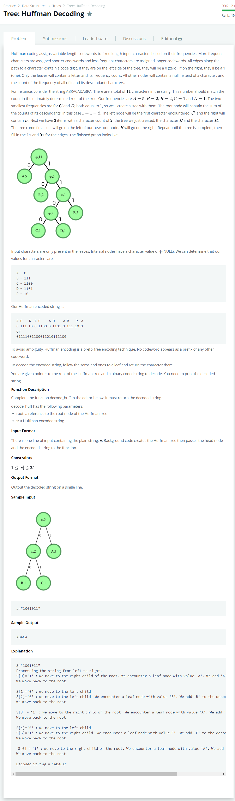

# [Tree: Huffman Decoding](https://www.hackerrank.com/challenges/tree-huffman-decoding/problem)




### My Answer

```python
def decodeHuff(root, s):
    result = []
    queue = Queue.Queue()
    for x in s : 
        queue.put(x)
    
    top = queue.get()
    head = root
    while True : 
        if top=='0' and head.left : 
            head=head.left
            if queue.qsize() : top = queue.get()
        elif top=='1' and head.right : 
            head=head.right
            if queue.qsize() : top = queue.get()
        else : 
            result.append(head.data)
            head=root
            if queue.qsize()==0 : break
    if top=='0' and head.left : 
        head=head.left
        result.append(head.data)
    elif top=='1' and head.right : 
        head=head.right
        result.append(head.data)
    else : 
        pass

    string = ''.join(result)
    print(string.replace('\x00',''))
```

* Time Complexity : O(n)
* Space Complexity : O(n)


### The things I got
