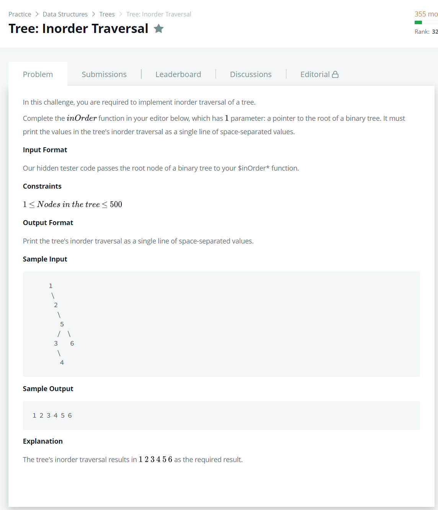

# [Tree: Inorder Traversal](https://www.hackerrank.com/challenges/tree-inorder-traversal/problem)




### My Answer

```python
def inOrder(root):
    if root.left : 
        inOrder(root.left)
    print(root.info,end=' ')
    if root.right : 
        inOrder(root.right)
```

* Time Complexity : O(n)
* Space Complexity : O(n)


### The things I got
