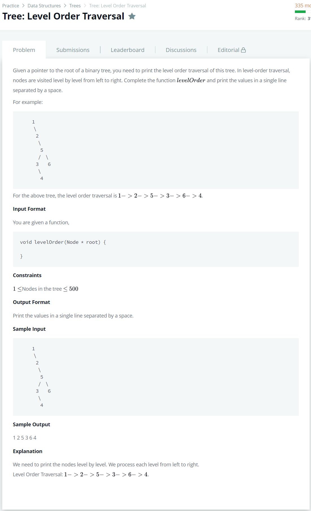

# [Tree: Level Order Traversal](https://www.hackerrank.com/challenges/tree-level-order-traversal/problem)




### My Answer

```python
def levelOrder(root):
    q = Queue()
    q.put(root)
    
    while not q.empty() : 
        node = q.get()
        print(node.info,end=' ')
        
        if node.left : 
            q.put(node.left)
        if node.right : 
            q.put(node.right)
```

* Time Complexity : O(n)
* Space Complexity : O(n)


### The things I got
